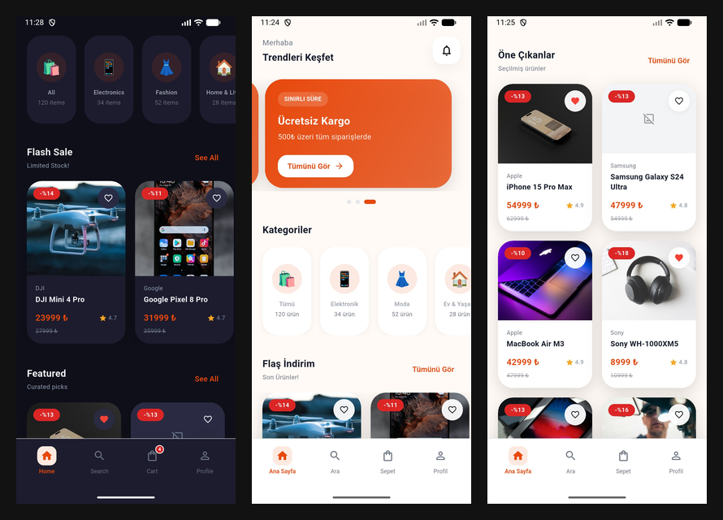

# 🛍️ Flutter E-Commerce UI Template

A modern, full-featured Flutter e-commerce UI template built with clean architecture.


## 📱 Screenshots



## ✨ Features

- 🏠 Home screen with banner slider & categories
- 🛍️ Product list & detail screens
- 🔍 Search with filters
- 🌙 Dark / Light theme
- 🌍 Localization ready (EN/TR)
- ⚡ Shimmer loading states
- 📱 Clean, responsive UI

## 🏗️ Built With

- **State Management** – Riverpod
- **Navigation** – GoRouter
- **Architecture** – Feature-first clean architecture

## 🚀 Getting Started

```bash
git clone https://github.com/USERNAME/REPO_NAME
cd REPO_NAME
flutter pub get
flutter run
```

## 📦 Full Version

This repo includes **Home, Product List and Search** screens only.

Full version includes:
- 🔐 Auth (Login, Register, Onboarding)
- 🛒 Cart & Checkout (3-step flow)
- 📦 Orders & Order Detail
- ❤️ Favorites
- 👤 Profile & Addresses
- ⚙️ Settings & Notifications

👉 **[Get Full Version on Gumroad](GUMROAD_LİNKİNİ_BURAYA_YAZ)**
